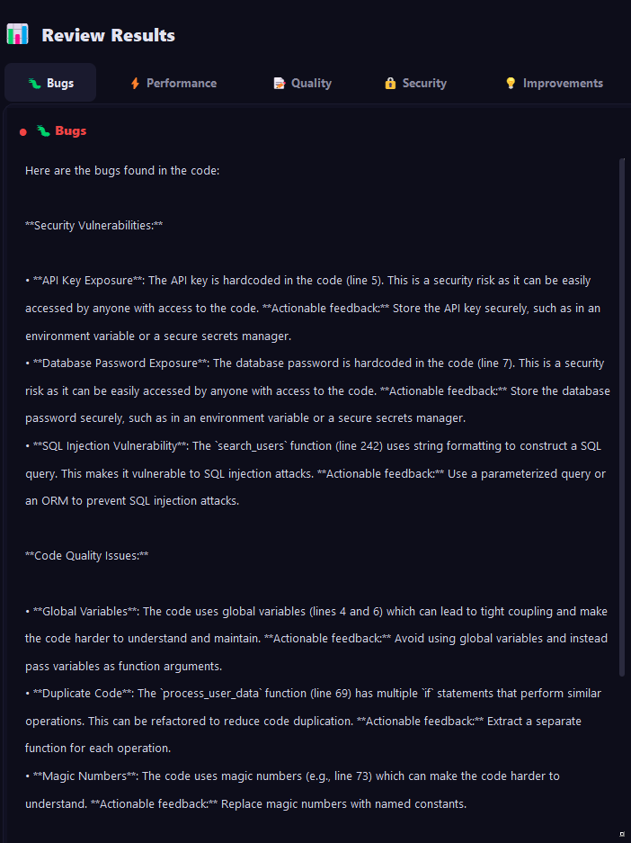
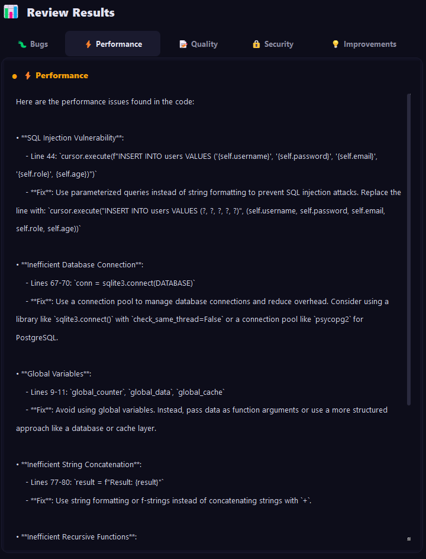
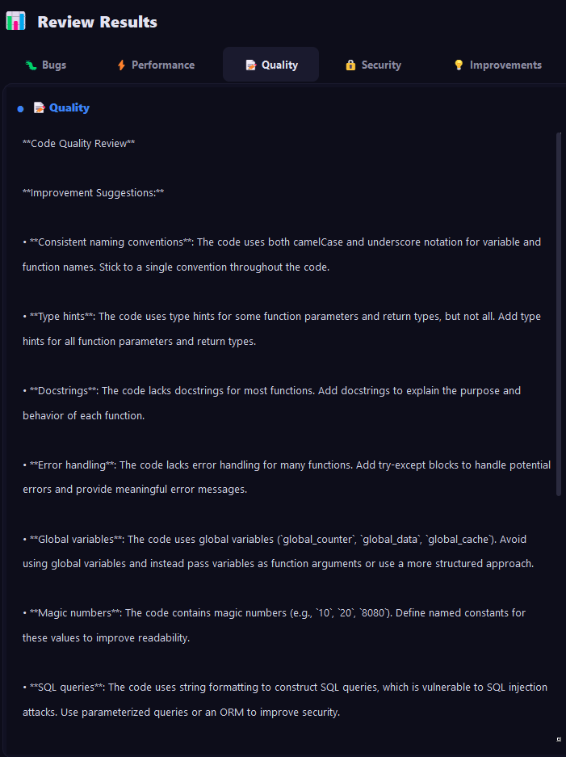
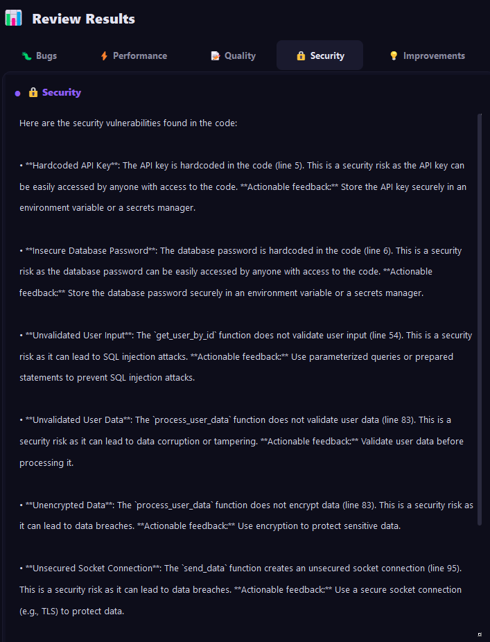
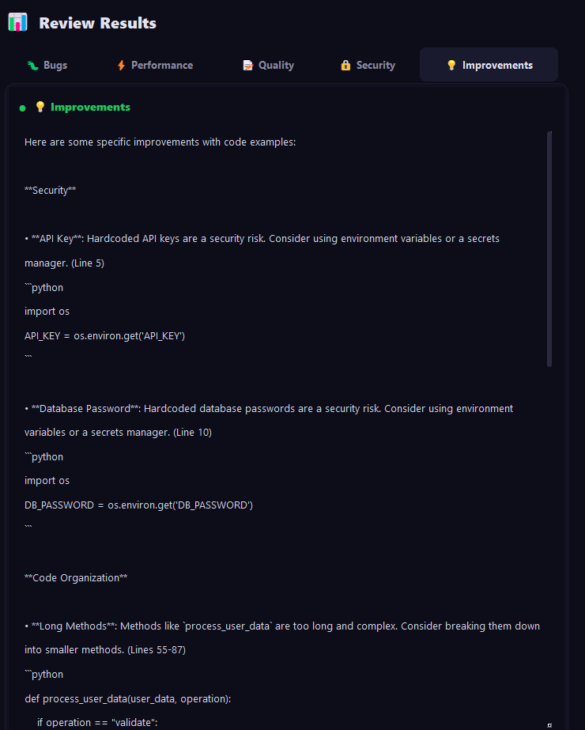

<div align="center">

# 🦅 CodeHawk

### *Hunt bugs. Ship clean code.*

[](https://python.org)
[](https://riverbankcomputing.com/software/pyqt/)
[](https://groq.com)
[](https://opensource.org/licenses/MIT)
[](http://makeapullrequest.com)

</div>

---

## 📌 Table of Contents

- [🎯 What is CodeHawk?](#-what-is-codehawk)
- [✨ Features](#-features)
- [📸 Screenshots](#-screenshots)
- [🚀 Quick Start](#-quick-start)
- [🔑 API Key Setup](#-api-key-setup)
- [🛠️ Tech Stack](#️-tech-stack)
- [📁 Project Structure](#-project-structure)
- [🤝 Contributing](#-contributing)
- [📄 License](#-license)
- [🙏 Acknowledgments](#-acknowledgments)

---

## 🎯 What is CodeHawk?

**CodeHawk** is an AI-powered code review assistant that analyzes your code for bugs, performance issues, code quality problems, security vulnerabilities, and improvements - all in one place.

> *"Stop wasting hours on manual code reviews. Let AI do the heavy lifting."*

### Why CodeHawk?

| Problem | Solution |
|---------|----------|
| 🐛 Hard-to-find bugs | AI detects hidden bugs instantly |
| ⚡ Slow code | Identifies bottlenecks and suggests fixes |
| 📝 Unreadable code | Recommends improvements for clarity |
| 🔒 Security vulnerabilities | Scans for SQL injection, hardcoded keys, and more |
| 💡 No improvement ideas | Gives actionable code examples |

---

## ✨ Features

<div align="center">

| Icon | Feature | Description |
|------|---------|-------------|
| 🐛 | **Bug Detection** | Find hidden bugs before they find you |
| ⚡ | **Performance Analysis** | Spot bottlenecks and slow code |
| 📝 | **Code Quality** | Improve readability and maintainability |
| 🔒 | **Security Audit** | Find vulnerabilities like SQL injection |
| 💡 | **Improvements** | Get actionable code examples |
| 🎨 | **Claude-style UI** | Side-by-side code review interface |
| 🧵 | **Multi-threading** | No UI freezes, smooth experience |

</div>

---

## 📸 Screenshots

<div align="center">

### 🐛 Bug Detection



*AI finds hidden bugs with exact line numbers*

---

### ⚡ Performance Analysis



*Identifies bottlenecks and slow code patterns*

---

### 📝 Code Quality



*Suggests improvements for readability and maintainability*

---

### 🔒 Security Audit



*Scans for SQL injection, hardcoded keys, and vulnerabilities*

---

### 💡 Actionable Improvements



*Provides specific code examples to fix issues*

</div>

---

## 🚀 Quick Start

### 📦 Prerequisites

```bash
# Clone the repository
git clone https://github.com/YOUR_USERNAME/CodeHawk.git
cd CodeHawk

# Install dependencies
pip install -r requirements.txt
